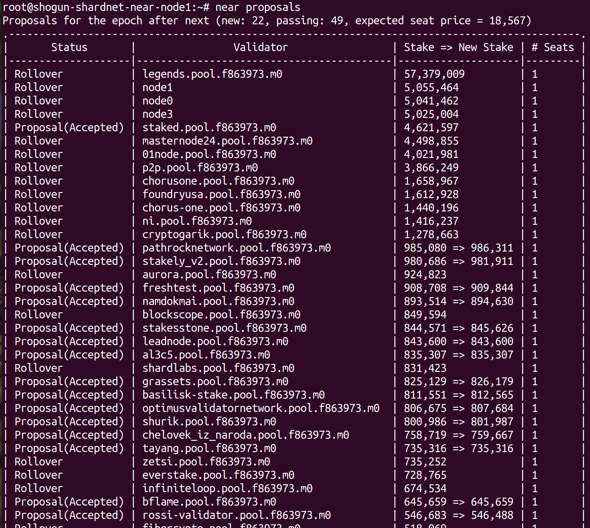
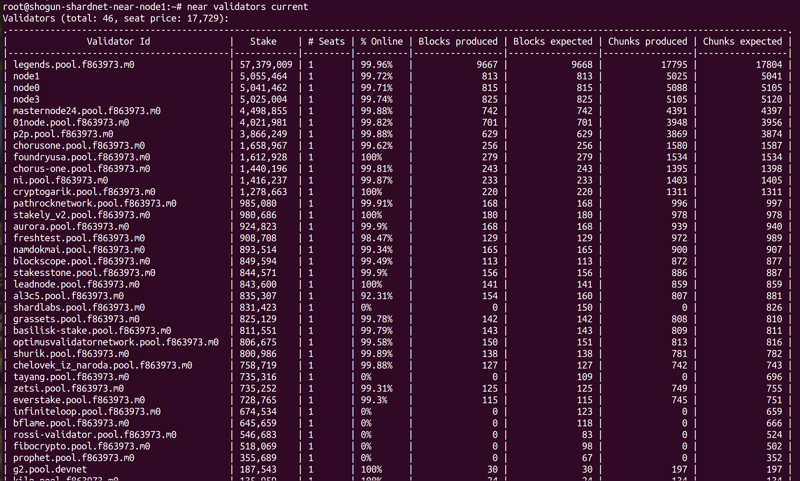
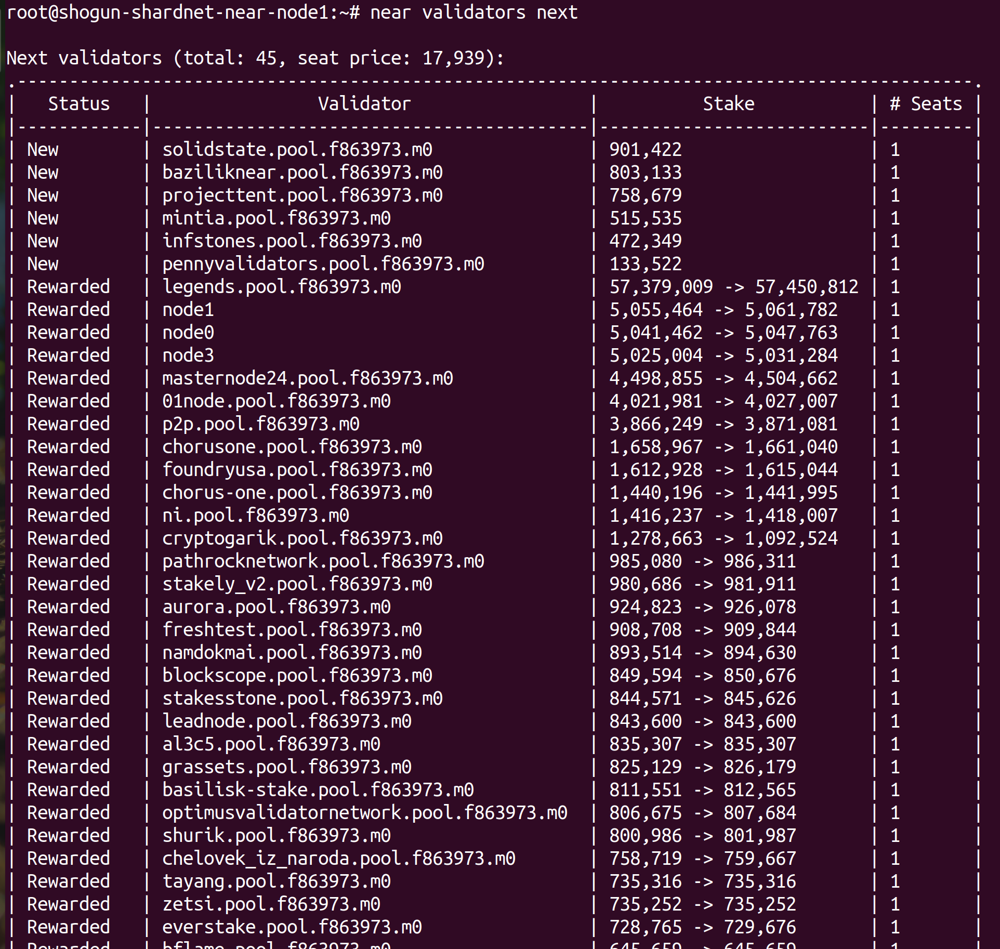

# Stake Wars: Episode III. Challenge 002

This challenge is focused on deploying a node (nearcore), downloading a snapshot, syncing it to the actual state of the network, then activating the node as a validator.

## Deliverables

1. Setup your validator
2. Setup Near CLI
3. CLI commands

## 1. For chunk-only producers, the hardware requirements are reduced significantly. Recommended specs are as following,
| Hardware       | Chunk-Only Producer  Specifications                                   |
| -------------- | ---------------------------------------------------------------       |
| CPU            | 8-Core CPU with AVX support                                           |
| RAM            | >16GB DDR4 (recommended is 20+ GB)                                    |
| Storage        | 500GB SSD                                                             |

## Dependencies
```
# Check system compatibility
lscpu | grep -P '(?=.*avx )(?=.*sse4.2 )(?=.*cx16 )(?=.*popcnt )' > /dev/null \
  && echo "Supported" \
  || echo "Not supported"
Supported

# Dependencies
sudo apt install -y git binutils-dev libcurl4-openssl-dev zlib1g-dev libdw-dev libiberty-dev cmake gcc g++ python3 docker.io protobuf-compiler libssl-dev pkg-config clang llvm cargo

# Install Python pip
sudo apt install python3-pip -y

# Include base bin path
USER_BASE_BIN=$(python3 -m site --user-base)/bin
export PATH="$USER_BASE_BIN:$PATH"

# Install build tools
sudo apt install clang make -y

# Install Rust
curl --proto '=https' --tlsv1.2 -sSf https://sh.rustup.rs | sh
# Choose 1 (Default install)

source $HOME/.cargo/env
```

## Build nearcore binary
Refer commit: 
``` f7f0cb22e85e9c781a9c71df7dcb17f507ff6fde``` 2022/08/16
```
# Clone nearcore repo
git clone https://github.com/near/nearcore
cd nearcore
git fetch origin --tags
git checkout <refer_commit>
git switch -c <refer_commit>

# Build the binary, this will take some time
cargo build -p neard --release --features shardnet

# Check version
./target/release/neard -V
neard (release trunk) (build 1.1.0-2644-gf7f0cb22e) (rustc 1.62.1) (protocol 100) (db 31)
```

## Initialize data directories

## 2. Setup Near CLI

Access to server via SSH and do the below commands. If you intend to use GCP to run your node, please refer Challenge 005 first.
```
# Update apt
sudo apt update && sudo apt upgrade -y

# Install Node.js and npm
curl -sL https://deb.nodesource.com/setup_18.x | sudo -E bash -  
sudo apt install build-essential nodejs -y
PATH="$PATH"

# Check version
node -v
v18.6.0

npm -v
8.13.2

# Install near-cli
sudo npm install -g near-cli

# For this chunk-only producer, we'll be using shardnet
echo 'export NEAR_ENV=shardnet' >> ~/.bashrc && source ~/.bashrc
```

## 3. CLI commands

*Proposals*

A proposal by a validator indicates they would like to enter the validator set, in order for a proposal to be accepted it must meet the minimum seat price.

Command: `near proposals`


*Validators Current*

This shows a list of active validators in the current epoch, the number of blocks produced, number of blocks expected, and online rate. Used to monitor if a validator is having issues.

Command: `near validators current`


*Validators Next*

This shows validators whose proposal was accepted one epoch ago, and that will enter the validator set in the next epoch.

Command: `near validators next`


Full list of Near CLI commands: https://github.com/near/near-cli

## Update log

Updated YYYY-MM-DD: TODO

Updated YYYY-MM-DD: TODO
