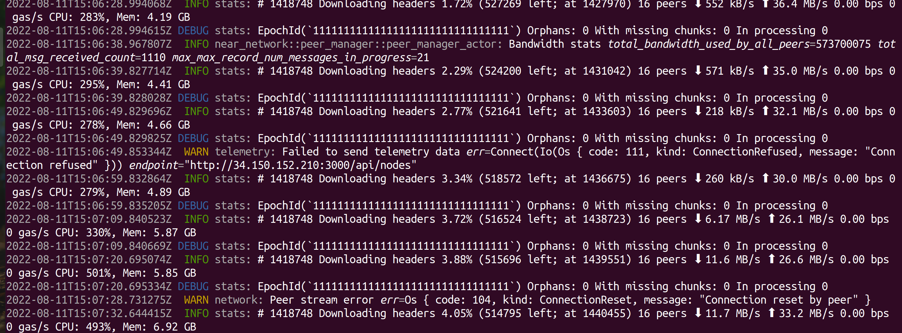
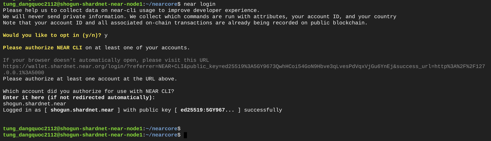
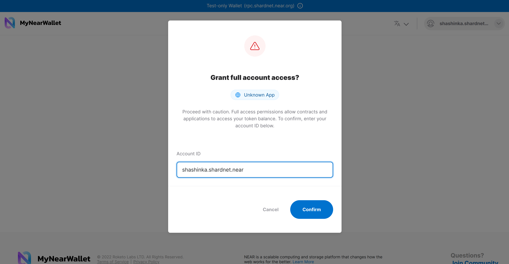

# Stake Wars: Episode III. Challenge 002

This challenge is focused on deploying a node (nearcore), downloading a snapshot, syncing it to the actual state of the network, then activating the node as a validator.

## Deliverables

1. Setup your validator
2. Configure keys

## 1. Setup your validator
For chunk-only producers, the hardware requirements are reduced significantly. Recommended specs are as following,
| Hardware       | Chunk-Only Producer  Specifications                                   |
| -------------- | ---------------------------------------------------------------       |
| CPU            | 8-Core CPU with AVX support                                           |
| RAM            | >16GB DDR4 (recommended is 20+ GB)                                    |
| Storage        | 500GB SSD                                                             |

## Dependencies
```
# Check system compatibility
lscpu | grep -P '(?=.*avx )(?=.*sse4.2 )(?=.*cx16 )(?=.*popcnt )' > /dev/null \
  && echo "Supported" \
  || echo "Not supported"
Supported

# Dependencies
sudo apt install -y git binutils-dev libcurl4-openssl-dev zlib1g-dev libdw-dev libiberty-dev cmake gcc g++ python3 docker.io protobuf-compiler libssl-dev pkg-config clang llvm cargo

# Install Python pip
sudo apt install python3-pip -y

# Include base bin path
USER_BASE_BIN=$(python3 -m site --user-base)/bin
export PATH="$USER_BASE_BIN:$PATH"

# Install build tools
sudo apt install clang make -y

# Install Rust
curl --proto '=https' --tlsv1.2 -sSf https://sh.rustup.rs | sh
# Choose 1 (Default install)

source $HOME/.cargo/env
```

## Build nearcore binary
Refer commit: 
``` f7f0cb22e85e9c781a9c71df7dcb17f507ff6fde``` 2022/08/16
```
# Clone nearcore repo
git clone https://github.com/near/nearcore
cd nearcore
git fetch origin --tags
git checkout <refer_commit>
git switch -c <refer_commit>

# Build the binary, this will take some time
cargo build -p neard --release --features shardnet

# Check version
./target/release/neard -V
neard (release trunk) (build 1.1.0-2644-gf7f0cb22e) (rustc 1.62.1) (protocol 100) (db 31)
```

## Initialize data directories
```
# Init .near folder
./target/release/neard --home ~/.near init --chain-id shardnet --download-genesis

# Replace config.json
rm ~/.near/config.json && wget -O ~/.near/config.json https://s3-us-west-1.amazonaws.com/build.nearprotocol.com/nearcore-deploy/shardnet/config.json

# Replace archive option
sed -e 's/"archive": false/"archive": true/' -i ~/.near/config.json

# Test that the node can start
cd nearcore
./target/release/neard --home ~/.near run
```

```
# Init .near folder
./target/release/neard --home ~/.near init --chain-id shardnet --download-genesis

# Replace config.json
rm ~/.near/config.json && wget -O ~/.near/config.json https://s3-us-west-1.amazonaws.com/build.nearprotocol.com/nearcore-deploy/shardnet/config.json

# Replace archive option
sed -e 's/"archive": false/"archive": true/' -i ~/.near/config.json

# Test that the node can start
cd nearcore
./target/release/neard --home ~/.near run
```

We will configure a system service for the daemon in later steps, for now keep the process running,  download all headers and sync to the latest block height. (This will take a fair amount of time). It’s sometime meet failed when send telemetry data but it’s just a warning, no problem.

After it sync fully, press Ctrl + C to quit this log session and comeback to console.

## 2. Configure keys
Go to your Near-CLI instance from challenge 001

For better clarity, we’ll provide examples for these parameters:

<account_id>: shogun.shardnet.near

<pool_name>: shogun

<pool_id>: shogun.factory.shardnet.near

## Install access key locally
```near login```
It will display as below, do some next step before comeback to this screen and input your wallet after login.

Copy the link and launch it your browser. This will ask you to provide full permission for wallet, just connect and input your full address.


Go back to the terminal and enter the same ID to complete login.
## Make a validator_key for your node from your wallet
```cp ~/.near-credentials/shardnet/shogun.shardnet.near.json ~/.near/validator_key.json```
## Edit validator_key.json
```
vim $HOME/.near/validator_key.json

{
	"account_id":"shogun.shardnet.near",
	"public_key":"ed25519:5GY9673QwhHCoi54GoN9Hbve3qLvesPdVqxVjGu6YnEj",
	"private_key":"ed25519:*******************************************"
}
```
Edit `account_id` to <pool_name>.factory.shardnet.near and `private_key` param to `secret_key`

You should end up with something like this

```
{
        "account_id":"shogun.factory.shardnet.near",
        "public_key":"ed25519:5GY9673QwhHCoi54GoN9Hbve3qLvesPdVqxVjGu6YnEj",
        "secret_key":"ed25519:*******************************************"
}

```

## Create system service
```
sudo vim /etc/systemd/system/neard.service

[Unit]
Description=neard
After=network-online.target

[Service]
Type=simple
User=<user_name>
WorkingDirectory=/home/<user_name>/.near
ExecStart=/home/<user_name>/nearcore/target/release/neard run   
Restart=on-failure
RestartSec=30
KillSignal=SIGINT
TimeoutStopSec=45
KillMode=mixed

[Install]
WantedBy=multi-user.target


# Enable daemon and start service
sudo systemctl enable neard.service
sudo systemctl start neard

# For pretty log printing
sudo apt install ccze -y

# Monitor log
journalctl -n 100 -f -u neard | ccze -A
```


