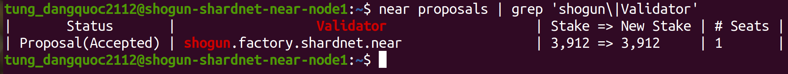

# Stake Wars: Episode III. Challenge 003

Deploy a new staking pool for your validator. Do operations on your staking pool to delegate and stake NEAR.

## Deliverables

1. Setup your validator
2. Configure keys

<account_id>: shogun.shardnet.near

<pool_name>: shogun

<pool_id>: shogun.factory.shardnet.near

## 1. Deploy a staking pool contract
Deploy a staking pool contract
```
near call factory.shardnet.near create_staking_pool '{"staking_pool_id": "<pool name>", "owner_id": "<account_id>", "stake_public_key": "<public key>", "reward_fee_fraction": {"numerator": 5, "denominator": 100}, "code_hash":"DD428g9eqLL8fWUxv8QSpVFzyHi1Qd16P8ephYCTmMSZ"}' --accountId="<account_id>" --amount=30 --gas=300000000000000
```

Staking to the pool
```
near call <pool_id> deposit_and_stake --amount <NEAR amount> --accountId <account_id> --gas=300000000000000
```
View staked balance
```
near view shogun.factory.shardnet.near get_account_staked_balance '{"account_id": "shogun.shardnet.near"}'
```
Misc functions you can invoke
```
# Unstake yoctoNEAR
near call <pool_id> unstake '{"amount": "<amount yoctoNEAR>"}' --accountId <account_id> --gas=300000000000000

near call shogun.factory.shardnet.near unstake '{"amount": "1501013553987867946208039512"}' --accountId shogun.shardnet.near --gas=300000000000000

# Unstake all NEAR
near call <pool_id> unstake_all --accountId <account_id> --gas=300000000000000

# Withdraw yoctoNEAR
near call <pool_id> withdraw '{"amount": "<amount yoctoNEAR>"}' --accountId <account_id> --gas=300000000000000

# Withdraw all NEAR
near call <pool_id> withdraw_all --accountId <account_id> --gas=300000000000000

# Staked Balance
near view <pool_id> get_account_staked_balance '{"account_id": "<account_id>"}'

# Unstaked Balance
near view <pool_id> get_account_unstaked_balance '{"account_id": "<account_id>"}'

near view shogun.factory.shardnet.near get_account_unstaked_balance '{"account_id": "shogun.shardnet.near"}'

# Available for Withdrawal
near view <pool_id> is_account_unstaked_balance_available '{"account_id": "<account_id>"}'

near view shogun.factory.shardnet.near is_account_unstaked_balance_available '{"account_id": "shogun.shardnet.near"}'

# Pause Staking
near call <pool_id> pause_staking '{}' --accountId <account_id>

# Resume Staking
near call <pool_id> resume_staking '{}' --accountId <account_id>
```

## Submit the proposal
In order to have a validator seat, you must submit a proposal with a ping. A ping issues a new proposal and updates the staking balances for your delegators. A ping should be issued each epoch to keep reported rewards current.
near call <pool_id> ping '{}' --accountId <account_id> --gas=300000000000000

Upon completion, you can check your node should be in proposals stage on Near ShardNet by this command:
```
near proposals | grep 'shogun'
```


