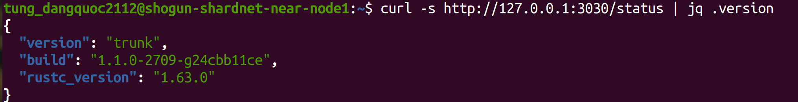
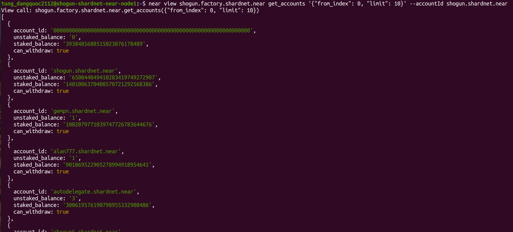
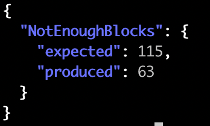
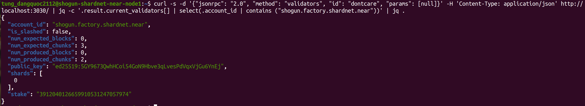

# Stake Wars: Episode III. Challenge 004

Setup tools for monitoring node status. Install and use RPC on port 3030 to get useful information for keep your node working.


## Common RPC commands
```# Check your node version
curl -s http://127.0.0.1:3030/status | jq .version
```


```
# Check delegators and stake 
near view shogun.factory.shardnet.near get_accounts '{"from_index": 0, "limit": 10}' --accountId shogun.shardnet.near 
```


```
# Check reason for validator kicked
curl -s -d '{"jsonrpc": "2.0", "method": "validators", "id": "dontcare", "params": [null]}' -H 'Content-Type: application/json' https://rpc.shardnet.near.org/ | jq -c '.result.prev_epoch_kickout[] | select(.account_id | contains ("shogun"))' | jq .reason
```
Most of the time reason is not produce enough block or chunk, it will show as below.


```
# Check blocks produced / expected 
curl -s -d '{"jsonrpc": "2.0", "method": "validators", "id": "dontcare", "params": [null]}' -H 'Content-Type: application/json' http://localhost:3030/ | jq -c '.result.current_validators[] | select(.account_id | contains ("shogun.factory.shardnet.near"))' | jq .
```
Your node must be active to be visualized by this command.


