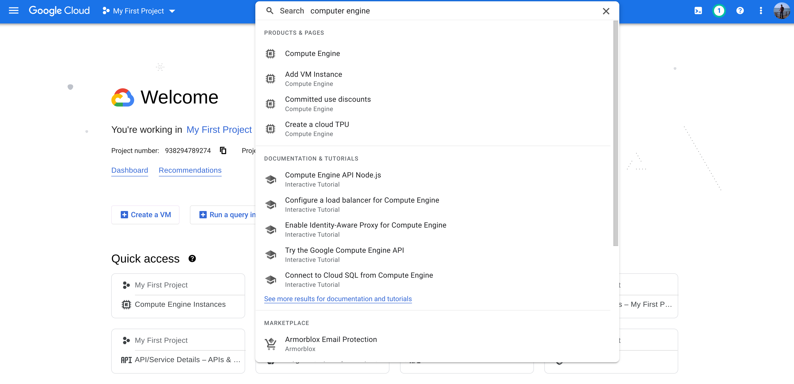
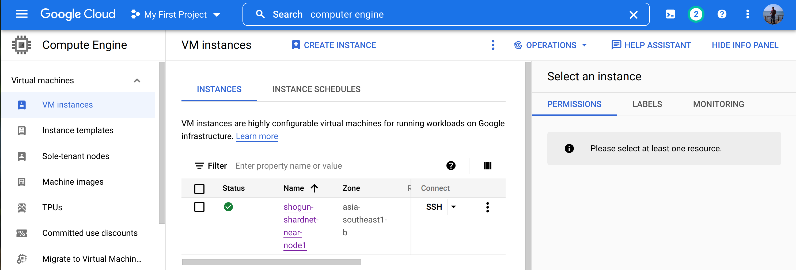
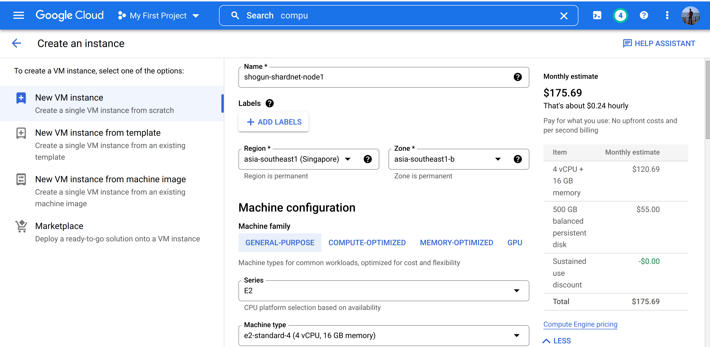
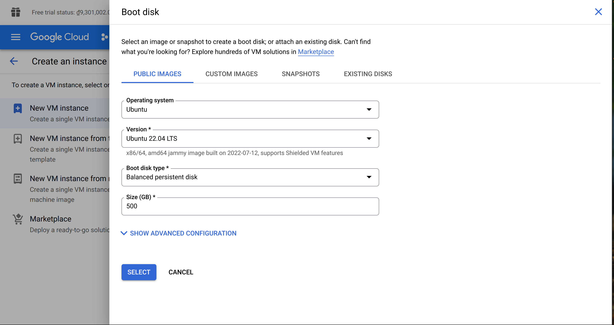
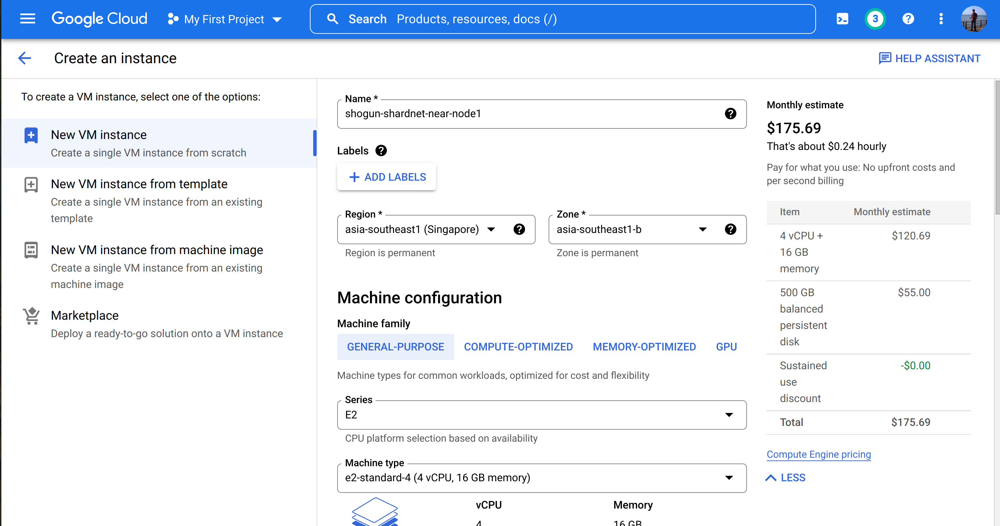
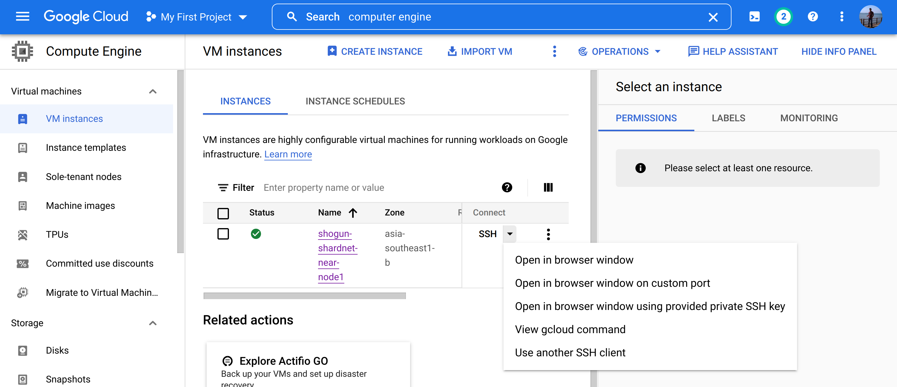
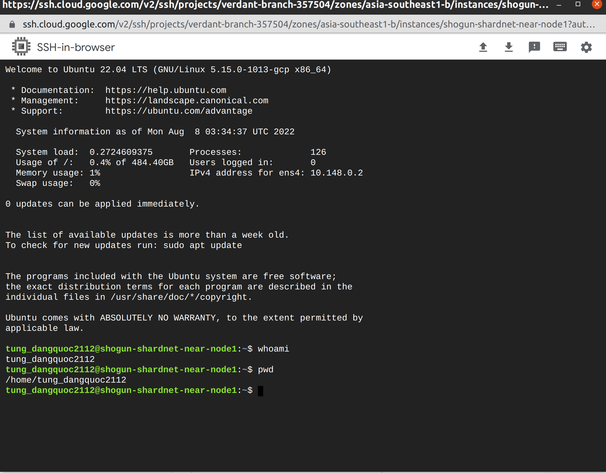

# Stake Wars: Episode III. Challenge 005

Setup a running validator node for shardnet on any one of the most popular cloud providers and document the process to create an article about it.

## Setup Validator Node on GCP (Google Cloud)
This guide help to create a Virtual Machine on GCP (Google Cloud Platform). Assume that you already registered GCP account at https://console.cloud.google.com
On the search bar, type computer choose Compute Engine

Clock ```Create Instance``` button

Name your instance, choose the Region that nearly you, and choose the node NEAR’s required specification.


Scroll down, on the Boot Disk, choose Edit to open a sub window, choose OS version, here should be Ubuntu 20 LTS, input required storage 500GB. Then click Select.


Keep the remains as default and scroll down to the button, click Create.


Wait some minutes. 

After your node created successfully, you can access to the node by click on SSH and choose Open in browser window.



That will open a ssh console on windows for you to type command.


## GCP Pricing
The pricing cost for this specification is about ~$176/month
