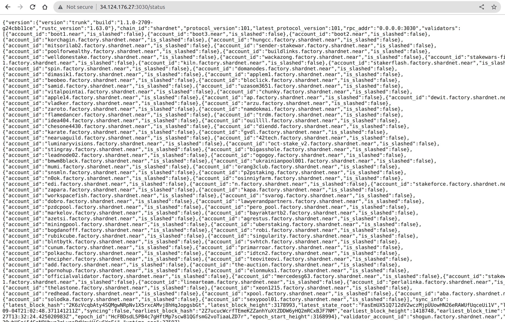

# Stake Wars: Episode III. Challenge 009

This challenge has two objectives:

- Monitor uptime above 70% on ShardNet
- Open the RPC port 3030 for analytics / reporting

## Monitor Uptime
Run below command to check your node’s uptime. Your node’s uptime depends on rate blocks produced/blocks expected and chunks produced/chunks expected. If your node can produce enough blocks and chunks, uptime will be high. 
```
export NEAR_ENV=shardnet
near validators current   | grep '<your_node>\|Validator'
```

Example:
```
export NEAR_ENV=shardnet
near validators current   | grep 'shogun\|Validator'
```

You can also check your node’s uptime at page: [https://openshards.io/shardnet-uptime-scoreboard](https://openshards.io/shardnet-uptime-scoreboard/) 

** Tips: you can reduce your staked NEAR in your node to keep expected blocks/chunks at low, it will keep your uptime higher.

## Open Port 3030 for Diagnostic Reporting
Check to see if PORT 3030 is open
```
sudo iptables -L | grep 3030
```

Open the port if not open
```
sudo iptables -A INPUT -p tcp --dport 3030 -j ACCEPT
```

Save the config for server restarts

You can use one of the 2 solutions:

** Using iptables-persistent
```
sudo apt install iptables-persistent
```

or if already installed
```
sudo dpkg-reconfigure iptables-persistent
```

** Using files
```
iptables-save > /etc/iptables/rules.v4
ip6tables-save > /etc/iptables/rules.v6
```

## Validate the port is open by visiting http://<your_server_ip>:3030/status
NOTE: In some cases the port may also need to be opened in your cloud provider / datacenter firewall.



